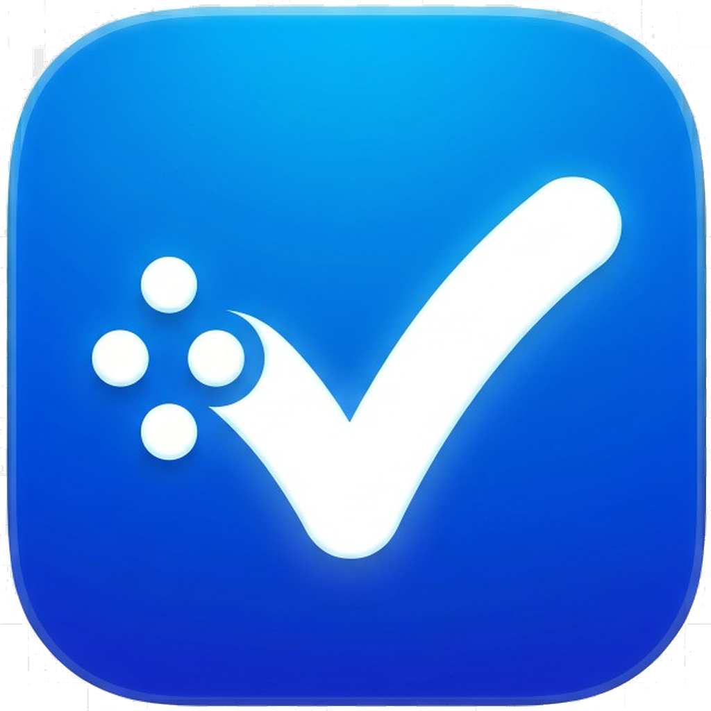

<div align="center">

# NowThis



**Privacy-first, self-hosted CalDAV task manager for iOS.**

[](LICENSE)
[](https://nowthis.app)

[Feature Highlights](#feature-highlights) • [Installation](#installation) • [Technical Details](#technical-details) • [Contributing](#contributing)

</div>

---

> [!IMPORTANT]  
> **NowThis is built natively in Swift, SwiftUI, and SwiftData.**

NowThis is a powerful, local-first iOS task manager that seamlessly syncs with any CalDAV server (including Nextcloud). Manage your to-dos, set geofence reminders, link journal entries, and keep your data 100% yours.

## Feature Highlights

* 🔒 **Local & Synced Modes:** Use Vault Mode for a purely offline experience, or connect to a CalDAV server (Nextcloud, etc.) to sync across devices.
* 📍 **Geofence Reminders:** Location-based task notifications (e.g., "Remind me when I get home").
* 🔄 **Reliable CalDAV Sync:** Robust background sync with ETag-based conflict detection to prevent silent overwrites.
* 📝 **Journal Links:** Attach journal entries to tasks for extended context.
* ⚡ **Native Performance:** Built from the ground up with SwiftUI and SwiftData for lightning-fast responsiveness.

## Installation

### For Users
The easiest way to get NowThis is through the [App Store](#) (coming soon!). 

### For Developers

NowThis uses [XcodeGen](https://github.com/yonaskolb/XcodeGen) to manage its project structure.

1. Clone the repository:
   ```bash
   git clone https://github.com/asecretcompany/nowthis-source.git
   cd nowthis-source
   ```
2. Install XcodeGen if you don't have it:
   ```bash
   brew install xcodegen
   ```
3. Set your Apple Developer Team ID:
   ```bash
   cp Local.xcconfig.template Local.xcconfig
   # Edit Local.xcconfig and add your TEAM_ID
   ```
4. Generate the Xcode project:
   ```bash
   xcodegen generate
   ```
5. Open `NowThis.xcodeproj` and build!

*(Note: The bundle identifier defaults to `com.asecretcompany.nowthis`. If you are building for your own physical device, you may need to update the bundle identifier prefix in `project.yml`.)*

## Technical Details

* **Architecture:** iOS client leveraging SwiftData for local persistence and CloudKit (via App Groups) for widget/app target data sharing.
* **Sync Engine:** Custom-built `CalDAVClient` using `os.Logger` for observability and actor-based concurrency for safe data handling.
* **Security:** `KeychainManager` securely stores server credentials with `kSecAttrAccessibleAfterFirstUnlockThisDeviceOnly`.

## Contributing

We welcome contributions! Please check out our [GitHub Pages site](https://opensource.nowthis.app) for more detailed documentation.

All code is licensed under the [GPLv3 License](LICENSE).
